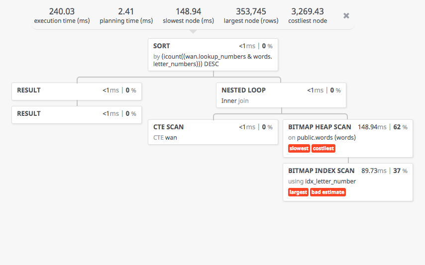

# Speedy Limeta

## Question

> Nekoč sem se srečal s situacijo, ko je v SQL bazi seznam vseh veljavnih besed (cca 100k).
Imaš npr 8 črk, zanima pa te katere vse besede iz slovarja lahko sestaviš s temi 8 ali manj črkami.
Primer: vhod ETRAMOIL, rešitve MILA, TAM, IME, LIMETA,... // [Uroš Kotolenko](https://twitter.com/ukotolenko) at [Slovenski Developerji](https://www.facebook.com/groups/272812582821861/permalink/1097738063662638/), November 2017  

## Setup

Prepare PostgreSQL...

```bash
# Create PG file structure
initdb -E utf8 db/pg-data -U postgres 

# Run PG in foreground
postgres -D db/pg-data

# Create database
createdb limeta -E utf8 -U postgres

# Create tables and load words
psql -U postgres limeta -a -f ./create_tables.sql

# Load words
psql -U postgres limeta -a -c "COPY words FROM '$(PWD)/data/words_si-SL.csv' CSV DELIMITER ','"
```

## Database structure

```sql
DROP TABLE IF EXISTS words;
CREATE EXTENSION IF NOT EXISTS intarray;

CREATE TABLE words (
  word          VARCHAR(60) NOT NULL,
  letter_numbers INT []
);

CREATE INDEX idx_letter_number ON words USING GIN(letter_numbers gin__int_ops);
```

## Lookup

```sql
WITH wan AS (
	SELECT ARRAY(SELECT ascii(unnest(regexp_split_to_array(upper('ETRAMOIL'), ''))))::int[] as lookup_numbers
)
SELECT words.word
FROM wan, words
WHERE wan.lookup_numbers @> words.letter_numbers
ORDER BY icount(wan.lookup_numbers & words.letter_numbers) DESC
```

## Explain

```bash
psql -U postgres limeta -qAt -f lookup.sql > analyse.json
```




## Data preparation / cleanup

```bash
./cleanup_words.py > ./data/words-si-SL.csv
```

## Credits

- [Slovar besed slovenskega jezika - Inštitut za slovenski jezik Frana Ramovša ZRC SAZU](http://bos.zrc-sazu.si/sbsj.html), November 2017

## Author

- [Oto Brglez](https://github.com/otobrglez)